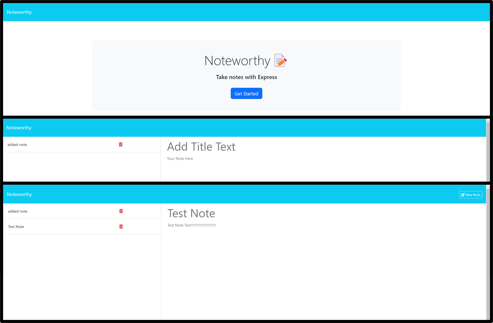

# Noteworthy

## Description

This is a created web application where I can add and remove notes. It allows for better time management and quick and easy access to reminders and notes on the go.

## Table of Contents

* [Installation](#installation)
* [Usage](#usage)
* [Contributing](#contributing)
* [Tests](#tests)
* [Questions](#questions)

* [License](#license)

## Installation

 - 1. Clone the repository
 - 2. Run `npm install` to install dependencies
 - 3. Run `node server.js` to start the server
 - 4. Open `http://localhost:3001` in your browser to view the application

## Usage

- Click on "Get Started" to start taking notes.
- Add a new note title and text, then click the "Save" button to save the note.
- Click on an existing note to view it.
- Click the trash icon to delete a note.

 

 

## Contributing

If you would like to contribute...

- You can create a new branch.
- Add your code.
- Then create a pull request.

I'll look it over and then merge it if I feel it is useful to the project. 

Or you can reach out at my email or github to colaborate.

## This project was made possible with the help of:

### [Adam Rosenberg](https://github.com/AcoderRose)

### [Kaila Ronquillo](https://github.com/girlnotfound)

## Tests

No testing at this time.

## Questions

If you have any questions about the repo, open an issue or contact me directly at rp26898@gmail.com. You can find more of my work at [RyanPetersen.89](https://github.com/RyanPetersen.89).

## License

This project is licensed under the MIT license.
